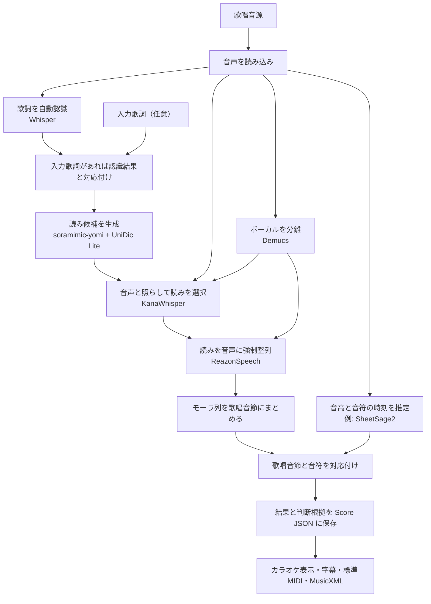

# Soramimic Score

Soramimic Score は、歌唱音源から歌詞、読み、モーラ（「きゃ」「ん」などの発音単位）の時刻、音符を推定する Python ライブラリです。
推定結果と判断根拠を一つの **Score JSON** に保存します。
ブラウザでは、音源と同期したピアノロールやカラオケ字幕を確認でき、標準 MIDI、MusicXML、SRT、LRC に書き出せます。

日本語の歌唱音源を対象とします。
歌詞や音高の推定には誤りがあり得るため、出力を利用する前に音源と照合してください。
拍子とテンポは推定せず、楽譜形式への書き出しには固定の時間軸を使います。

## 処理の流れ



歌詞とメロディを別々に推定します。
歌詞側ではモーラの時刻を求め、読みのモーラ列を歌唱音節にまとめます。
最後に歌唱音節と音符を対応付けます。
たとえば「カン」は「カ」「ン」の 2 モーラを含む 1 音節として扱います。
1 音節が複数の音符にまたがる場合もあります。
入力歌詞がある場合も Whisper で歌唱区間を探し、認識結果と入力歌詞を対応付けます。
対応した箇所では入力歌詞の表記から読みを決め、その読みを音声に整列します。
対応が取れない入力行は未解決として記録し、歌われていないとは断定しません。

読み候補は `soramimic-yomi` で作り、UniDic Lite で別の候補を補います。
原音と分離したボーカルを比較して候補を選び、音声から判断できなければ既定の読みを維持します。
モーラの時刻は主に分離したボーカルから、音符は原音から推定します。
歌詞認識や音高推定のモデルは交換できます。標準構成は Whisper large-v3、KanaWhisper、HTDemucs、ReazonSpeech、SheetSage2、MERT-v2-FullSong です。調整時と以下の現行 Score の評価でもこの構成を使っており、通常はこの構成での実行を想定しています。モデルの重みは同梱しません。

## 現行版の解析サンプル

[PJS コーパス](https://sites.google.com/site/shinnosuketakamichi/research-topics/pjs_corpus)の `pjs001`（16 秒）を、歌詞を入力せずに Soramimic Score で解析しました。原音を聴きながら、Score の音符と認識歌詞を正解譜面・読みと比較できます。水色が Score の未補正の音符、黄色の枠が正解譜面です。

[](https://github.com/soramimic/soramimic-score/releases/download/sample-pjs001-20260926/pjs001-score-sample.mp4)

[音声付きの 16 秒動画を見る](https://github.com/soramimic/soramimic-score/releases/download/sample-pjs001-20260926/pjs001-score-sample.mp4)

この例では音符を 42 個推定し、正解譜面も 42 個です。開始時刻 ±50 ms・音高 ±50 セントで採点した音符 F1 は **85.7%** です。

注：この例では出力音高が正解譜面より 1 オクターブ高く、採点時に一律 12 半音下げています。動画には調整前の音符を表示しています。

音源と正解譜面は PJS コーパスの Junya Koguchi、Shinnosuke Takamichi によるものです。動画と画像は [CC BY-SA 4.0](https://creativecommons.org/licenses/by-sa/4.0/) で公開しています。

## 精度評価

現行の Soramimic Score で開発用の日本語 J-POP 9 曲を解析し、同じ音源に対応する歌詞付き譜面のメロディ音符と比較しました。9 曲とも解析を完了し、正解音符は計 5,814 個です。音符の F1 は全曲の音符をまとめて計算し、開始時刻が ±50 ms 以内、音高が ±50 セント以内なら一致とします。「終了も一致」では、終了時刻の誤差が 50 ms または正解音長の 20% の大きい方以内であることも求めます。採点時は正解譜面の開始時刻を使い、曲・方式ごとに一定の時刻差を補正します。音域のずれに対しては、方式ごとに一律のオクターブ移動を許容します。

| 歌詞の入力 | 開始・音高 F1 | 開始・音高・終了 F1 |
| --- | ---: | ---: |
| 自動認識 | 76.8% | 61.5% |
| 正解歌詞を指定 | 76.9% | 61.5% |

歌詞の誤り率も同じ 9 曲で測りました。表記は空白と句読点を除いた文字列、カナは「キャ」のような拗音を 1 個とするモーラ列で比べます。カナには「ン」「ー」「ッ」を含めます。母音は各モーラから取り出した a・i・u・e・o の列で比べ、「ン」「ー」「ッ」は正解と推定の両方から除きます。いずれも編集距離を正解列の長さで割った値で、低いほど誤りが少ないことを表します。

| 歌詞の入力 | 表記の文字誤り率 | カナ誤り率 | 母音誤り率 |
| --- | ---: | ---: | ---: |
| 自動認識 | 13.4% | 11.5% | 8.0% |
| 正解歌詞を指定 | 3.3% | 7.7% | 5.8% |

音符の開始時刻・音高に加え、その音符に付いたモーラの読みも一致するかを調べました。読みは「トー」と「トオ」のように同じ発音になる表記をそろえて比較し、1 音符に複数のモーラが付く場合は全体の読みが一致したときだけ数えます。一致率は正解音符を分母とし、F1 は余分な推定音符も考慮します。

| 歌詞の入力 | 開始・音高・モーラ一致率 | 開始・音高・モーラ F1 |
| --- | ---: | ---: |
| 自動認識 | 68.9%（4,007 / 5,814） | 66.8% |
| 正解歌詞を指定 | 70.7%（4,112 / 5,814） | 68.8% |

### 公開実装との比較

同じ開発用 J-POP 9 曲の全曲を、歌詞付き譜面の計 5,814 音符と比較しました。[STARS](https://github.com/gwx314/STARS) の公開モデルには、分離したボーカルと Score が自動認識した発音列を渡しています。[Vocal2Midi](https://github.com/Xiantaidu/Vocal2Midi/tree/9c5826a407274c2e2dbacb79d41a4eee611f55de) には同じ分離ボーカルを渡し、付属の日本語歌唱認識、歌詞整列、音符抽出を使いました。Vocal2Midi には Score の認識歌詞も正解歌詞も渡していません。

| 方法 | 開始・音高 F1 | 開始・音高・モーラ F1 |
| --- | ---: | ---: |
| Score | 76.8% | 66.8% |
| STARS | 21.0% | 0.6% |
| Vocal2Midi | 68.9% | 27.8% |

STARS と Vocal2Midi の音高は採点時に一律 12 半音上げています。STARS には 1 モーラを 1 単位として渡し、推定されたその区間と音符の重なりから読みを対応付けました。STARS は音素ごとの時刻も出力します。

Vocal2Midi は日本語モーラ認識に RomajiASR v1.0.0、整列に HubertFA v0.0.7、音符抽出に GAME 1.0.3 medium を使用しました。音符に付いた「-」は直前のモーラの継続として採点します。

STARS の公開モデルは日本語を学習対象としていないため、STARS との差は各方式の一般的な優劣を示すものではありません。

## 動作要件

| 項目 | 要件 |
| --- | --- |
| ソフトウェア | Python 3.11 以降、Git、FFmpeg、FFprobe。ブラウザの起動例には `uv` も使います。 |
| 計算装置 | CPU で実行できます。CUDA 対応 GPU は任意です。 |
| モデル | [SheetSage2](https://huggingface.co/m-a-p/SheetSage2) と [MERT-v2-FullSong](https://huggingface.co/m-a-p/MERT-v2-FullSong) をローカルに配置します。Whisper などのモデルは初回使用時に取得します。 |
| ストレージ | 上記 2 モデルの重みだけで約 2.8 GB 必要です。ほかのモデル、依存ライブラリ、解析中の一時ファイルの容量も別に必要です。 |

RAM と GPU メモリの最低容量は、音源の長さや使用するモデルによって変わるため、まだ検証できていません。

### 解析時間とメモリ使用量の計測例

Ubuntu 24.04、Ryzen 7 5700X（8 コア、16 スレッド）、RAM 64 GB、RTX 4060 Ti（GPU メモリ 16 GB）で、35 秒の歌唱音源を解析しました。
Whisper large-v3、KanaWhisper、HTDemucs、ReazonSpeech、SheetSage2、MERT-v2-FullSong を使用し、全モデルを上記の環境で実行しました。
モデルは取得済みで、入力は WAV、正解歌詞の指定と歌い直しはありません。

| 実行方法 | 解析時間 | プロセスの最大 RSS | GPU メモリの観測最大値 |
| --- | ---: | ---: | ---: |
| CPU | 3 分 00 秒 | 約 7.0 GiB | 使用せず |
| CUDA | 24 秒 | 約 7.1 GiB | 約 4.1 GiB |

各条件を 1 回ずつ計測した結果です。
GPU メモリは `nvidia-smi` で 1 秒ごとに観測した値で、瞬間的な最大値を保証するものではありません。
音源や実行環境によって所要時間とメモリ使用量は変わるため、この表の値は最低動作要件ではありません。

## ブラウザで使う

必要なソフトウェアとモデルを用意し、各モデルの利用条件を確認してください。
`SORAMIMIC_SCORE_DATA` には Git リポジトリ外の保存先を指定します。
次のパスは配置先の例です。

```sh
uv sync --extra audio --extra web
export SORAMIMIC_SCORE_SHEETSAGE_MODEL=/path/to/SheetSage2
export SORAMIMIC_SCORE_SHEETSAGE_BASE=/path/to/MERT-v2-FullSong
export SORAMIMIC_SCORE_DATA=/path/to/private-score-data
uv run --extra audio --extra web uvicorn soramimic_score.web:app --host 127.0.0.1 --port 8313 --no-access-log
```

起動後、ブラウザで `http://127.0.0.1:8313/` を開きます。
デモ GUI で音源を解析し、歌詞と音符をピアノロールで確認できます。

## コマンドラインで使う

上記のソフトウェアとモデルを用意します。
ソースを取得したディレクトリで、音声用の依存ライブラリをインストールします。

```sh
pip install '.[audio]'
```

以下のパスは配置先の例です。

```sh
soramimic-score analyze song.mp3 \
  --sheetsage-model models/SheetSage2 \
  --sheetsage-base models/MERT-v2-FullSong \
  --output work/song.score.json
```

既定では CPU を使います。
GPU を使う場合は `--device cuda` を指定してください。
Whisper、Demucs、KanaWhisper、ReazonSpeech は初回使用時に取得します。
取得済みのモデルだけを使う場合は `--local-files-only` を指定します。
入力歌詞は `--lyrics lyrics.txt` で指定できます。
ファイルは UTF-8 で、1 行を 1 フレーズとします。

### 入力歌詞の読み

入力歌詞と認識結果が対応した箇所では、歌詞と読みを入力歌詞から決めます。

漢字などに複数の読みがある場合は、既定で KanaWhisper の結果を使って候補を選びます。
音声から判断できなければ、入力歌詞側の既定の読みを使います。
`｜明日《あした》` のようにルビを指定した箇所は、その読みを使います。
音声による候補の選択を省く場合は `--dictionary-readings` を指定してください。

認識結果と入力歌詞の改行位置が異なっていても、対応したまとまりの中で読みを決めてから最終的な強制整列を行います。
整列に失敗した場合はエラーを返し、認識結果の読みへ自動では戻しません。
対応しない認識行は自動認識の結果として残します。
この読みの処理は `--adjust-lyrics` を指定しなくても行います。

自動認識でクレジットに似た行が出た場合は、同じ区間に歌唱音符があれば短く再認識します。
歌詞が得られなければその行を除外しますが、入力歌詞に書かれた行は保持します。

### 入力歌詞を音源に合わせて調整する

`--lyrics lyrics.txt --adjust-lyrics` を指定すると、認識結果との照合に基づいて、歌われていないと判断した行を外し、繰り返しや不足する行を補います。
指定しなければ入力歌詞の行を削除・補完しません。
認識ミスによる誤った削除や追加を避けるため、このオプションは初期設定で無効です。

調整は行単位で行い、行の途中の言葉は切り貼りしません。
認識結果と改行位置が異なる場合は、前後最大 4 行をまとめて照合します。
入力歌詞のどの行も対応付けられない場合は、認識結果で置き換えずエラーを返します。
元の入力、認識結果、採用した行、削除・補完の判断は Score JSON の `lyric-adjustment` 根拠に残します。
調整後の歌詞で読みと時刻を推定するため、結果を音源と照合してください。

Python からは `analyze_audio(..., lyrics=lines, adjust_lyrics=True)` と指定します。

### 音声モデルの設定

ボーカル分離と音声による読みの選択は初期設定で有効です。
原音から発音時刻を推定する場合は `--no-vocal-separation` を指定します。
音声で読みを比較せず辞書の候補を使う場合は `--dictionary-readings` を指定します。
どちらの場合も `soramimic-yomi` は読みの生成に使います。
分離した音声は一時ファイルとして扱い、解析終了時に削除します。

Demucs の取得済み重みを指定する場合は、`--demucs-checkpoint models/955717e8-8726e21a.th` を追加します。
指定しなければ PyTorch のモデルキャッシュを使います。

## Python から使う

`analyze_audio` で音源を解析し、`dump` で Score JSON を保存します。

```python
from pathlib import Path
from soramimic_score import ModelConfig, analyze_audio, dump

config = ModelConfig(
    sheetsage_model=Path("models/SheetSage2"),
    sheetsage_base=Path("models/MERT-v2-FullSong"),
)
score = analyze_audio("song.wav", model_config=config)
dump(score, "work/song.score.json")
```

入力歌詞を渡した場合は、`lyric_surface(score)` から表示用の歌詞と対応付けの結果を取得できます。
Score JSON の `lyric-surface` 根拠には、元の入力、対応する行の ID、表示文字列、未対応行、読み候補と選択結果を保存します。
`canonical` は対応した入力歌詞と確定した読みを保持します。
認識時と最終結果の行番号は別々に記録します。
文字単位の時刻を推測して入力歌詞へ割り当てることはしません。

```python
from soramimic_score import lyric_surface

score = analyze_audio("song.wav", model_config=config, lyrics=["青い空", "白い雲"])
display = lyric_surface(score)
print(display["display_text"])
```

認識済みの観測データから Score JSON を作る場合は、音声モデルを実行せずに変換できます。

```python
from soramimic_score import compile_score, dump

score = compile_score(observations)
dump(score, "song.score.json")
```

同じ変換を CLI から行う場合は、次のコマンドを使います。

```sh
soramimic-score --input observations.json --output song.score.json
```

入力 JSON の形式と対応付けの詳細は、[開発者向け説明](soramimic_score/README.md)を参照してください。
このリポジトリには、音源、完全な歌詞、MIDI、モデルの重み、ユーザーの投稿データ、評価用正解データを含めません。

## ライセンス

本リポジトリのコードには [MIT ライセンス](LICENSE)を適用します。
依存ライブラリ、辞書、モデルにはそれぞれの利用条件が適用されます。
標準構成の SheetSage2 と MERT-v2-FullSong には非商用条件があります。
詳細は[外部ライブラリ・モデルの利用条件](THIRD_PARTY_NOTICES.md)を確認してください。
